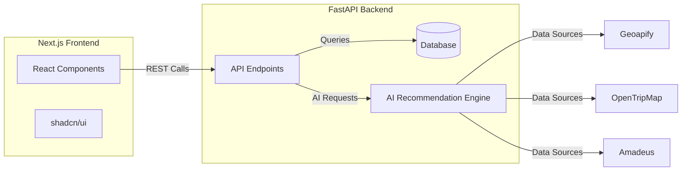

# Wanderlust AI

[](https://github.com/Yashavanth-H/wanderlust-ai/stargazers)
[](https://github.com/Yashavanth-H/wanderlust-ai/blob/main/LICENSE)

> **Wanderlust AI** – An AI‑powered travel recommendation platform that helps users discover hidden gems across India.

---

## Table of Contents
- [Tech Stack](#tech-stack)
- [Architecture](#architecture)
- [Setup & Installation](#setup--installation)
- [Running the Project](#running-the-project)
- [Testing](#testing)
- [Contributing](#contributing)
- [License](#license)

---

## Tech Stack
- **Frontend**: Next.js (App Router) • TypeScript • Tailwind CSS • shadcn/ui components
- **Backend**: Python (FastAPI) • Poetry for dependency management
- **APIs**: Amadeus, Geoapify, OpenTripMap
- **Database**: SQLite (development) • PostgreSQL (production)
- **Deployment**: Vercel (frontend) • Railway / Render (backend)
- **CI/CD**: GitHub Actions

---

## Architecture


---

## Setup & Installation
```bash
# Clone the repository
git clone https://github.com/Yashavanth-H/wanderlust-ai.git
cd wanderlust-ai

# Frontend setup
cd project
npm install

# Backend setup (using Poetry)
cd ../backend
poetry install
```

---

## Running the Project
```bash
# Start the frontend (development server)
cd project
npm run dev

# Start the backend (development server)
cd ../backend
poetry run uvicorn app.main:app --reload
python3 -m uvicorn app.main:app --reload 

or 

pip i
nstall -r requirements.
txt && python3 -m uvico
rn app.main:app --reloa
```
Open http://localhost:3000 for the frontend and http://localhost:8000/docs for the API docs.

---

## Testing
```bash
# Frontend tests (Jest)
cd project
npm test

# Backend tests (pytest)
cd ../backend
pytest -q
```

---

## Contributing
We welcome contributions! Please read our [CONTRIBUTING.md](CONTRIBUTING.md) for guidelines on how to submit pull requests, report issues, and propose new features.

---

## License
This project is licensed under the MIT License – see the [LICENSE](LICENSE) file for details.
